<!-- Hero -->

  <picture>
    <source media="(max-width: 480px)" srcset="images/header_720w.gif">
    <source media="(max-width: 1279px)" srcset="images/header_960w.gif">
    
  </picture>

<!-- Title -->
<h3 align="center">CRAFT SAMO</h3>

<!-- Description -->

  

<!-- Social Link -->

  

    
    
    
    
    
  

<!-- Expertise -->

  

    
    
    
    
    
    
    
    
  

---

<!-- Contribution Snake -->
### 🐍 Contribution Snake

  <picture>
    <source media="(prefers-color-scheme: dark)" srcset="./images/github-contribution-grid-snake-dark.svg">
    <source media="(prefers-color-scheme: light)" srcset="./images/github-contribution-grid-snake.svg">
    
  </picture>

---

<!-- Languages -->
### 💻 Languages

  

---

<!-- Follow-up -->
### 🎟️ Follow-up

  

---

<!-- Achievements -->
### 🏆 Achievements

  

---

<!-- Activity Graph -->
### 📊 GitHub Activity

  

